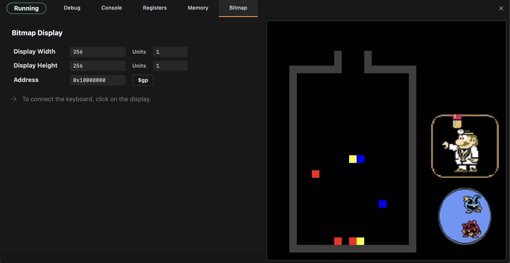

# Dr.-Mario---MIPS-Assembly
A fully functional Dr. Mario-style game written in MIPS Assembly!

Gameplay
========

**Objective**
- The goal is to eleminate all viruses on the screen.
- The microscope in the bottom-right shows which colors of viruses remain.
- The game gradually speeds up, so be sure to clear the viruses quickly!

**Core Mechanics**
1. Capsules fall from the top of the screen.
2. Control the capsule using the keyboard: move left with `A`, right with `D`, drop faster with `S`, rotate with `W`, and save the capsule with `Z`.
3. To eleminate viruses or capsules, you need 4 or more segments of the same color in a line.
4. Other keyboard controls: quit with `q`, pause with `p`, and restart with `r`.

Running the Game
================

1. [Download the Dr. Mario repository.](https://github.com/daniilio/Dr.Mario---MIPS-Assembly/archive/refs/heads/main.zip)
2. [Download Saturn.](https://github.com/1whatleytay/saturn/releases)
3. Open the **drmario.asm** file in Saturn.
4. Click `↓` → `Bitmap`, set the values to match the gameplay picture above.
5. While in the Bitmap window, click `▶` to start the game.
6. To enter keyboard input, click into the gameplay screen in the bottom right.
